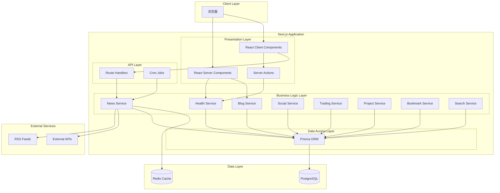

# Design Document

## Overview

Personal OS System 是一个全栈 TypeScript 个人管理系统，采用 Next.js 15 App Router 架构，将前后端代码统一在单一代码库中。系统通过 React Server Components 优化性能，使用 Prisma + PostgreSQL 管理数据持久化，并通过 shadcn/ui + Tailwind CSS 构建现代化的用户界面。

系统核心设计理念：
- **单体全栈架构**：前后端共享类型定义，减少接口对接成本
- **Server-First 渲染**：默认使用 Server Components，仅在必要时使用 Client Components
- **模块化设计**：8 个业务模块 + 1 个公共基础层，各模块独立但可互相关联
- **渐进式开发**：支持按阶段迭代，从核心功能到高级特性逐步完善

## Architecture

### 系统架构图



### 技术栈

**前端层**
- React 19：UI 框架
- Next.js 15 App Router：全栈框架
- TypeScript：类型安全
- Tailwind CSS：样式框架
- shadcn/ui：UI 组件库
- Recharts：数据可视化
- TanStack Query：客户端状态管理
- Zustand：轻量全局状态

**后端层**
- Next.js Route Handlers：REST API
- Next.js Server Actions：表单处理
- Prisma：ORM
- PostgreSQL：关系型数据库
- Redis：缓存层（可选）

**开发工具**
- Turbopack：构建工具
- ESLint + Prettier：代码规范
- Vitest：单元测试

### 目录结构

```
personal-os/
├── app/                          # Next.js App Router
│   ├── (auth)/                   # 认证相关页面
│   │   ├── login/
│   │   └── register/
│   ├── (dashboard)/              # 主应用布局
│   │   ├── layout.tsx            # 左侧导航 + 顶部栏
│   │   ├── page.tsx              # 仪表盘首页
│   │   ├── health/               # 健康模块
│   │   │   ├── page.tsx
│   │   │   ├── habits/
│   │   │   └── logs/
│   │   ├── blog/                 # 博客模块
│   │   │   ├── page.tsx
│   │   │   ├── [id]/
│   │   │   └── new/
│   │   ├── news/                 # 资讯模块
│   │   ├── social/               # 社媒模块
│   │   ├── trading/              # 交易模块
│   │   ├── projects/             # 项目模块
│   │   └── bookmarks/            # 收藏模块
│   ├── api/                      # API Routes
│   │   ├── health/
│   │   ├── blog/
│   │   ├── news/
│   │   │   └── refresh/          # 定时任务触发端点
│   │   ├── social/
│   │   ├── trading/
│   │   ├── projects/
│   │   ├── bookmarks/
│   │   └── search/
│   └── globals.css
├── components/                   # React 组件
│   ├── ui/                       # shadcn/ui 组件
│   ├── dashboard/                # 仪表盘组件
│   ├── health/                   # 健康模块组件
│   ├── blog/                     # 博客模块组件
│   ├── news/                     # 资讯模块组件
│   ├── social/                   # 社媒模块组件
│   ├── trading/                  # 交易模块组件
│   ├── projects/                 # 项目模块组件
│   ├── bookmarks/                # 收藏模块组件
│   ├── charts/                   # 图表组件
│   └── layout/                   # 布局组件
│       ├── sidebar.tsx
│       └── header.tsx
├── lib/                          # 业务逻辑
│   ├── services/                 # 服务层
│   │   ├── health.ts
│   │   ├── blog.ts
│   │   ├── news.ts
│   │   ├── social.ts
│   │   ├── trading.ts
│   │   ├── projects.ts
│   │   ├── bookmarks.ts
│   │   └── search.ts
│   ├── actions/                  # Server Actions
│   │   ├── health.ts
│   │   ├── blog.ts
│   │   └── ...
│   ├── utils/                    # 工具函数
│   └── validations/              # 数据验证
├── prisma/
│   ├── schema.prisma             # 数据模型定义
│   ├── migrations/
│   └── seed.ts
├── types/                        # TypeScript 类型定义
├── scripts/                      # 脚本
│   └── fetch-news.ts             # 资讯抓取脚本
└── public/
```

## Components and Interfaces

### 数据模型设计

#### 公共基础模型

**User（用户）**
```prisma
model User {
  id        String   @id @default(cuid())
  email     String   @unique
  name      String
  avatar    String?
  timezone  String   @default("Asia/Shanghai")
  createdAt DateTime @default(now())
  updatedAt DateTime @updatedAt
  
  // 关联
  healthLogs        HealthDailyLog[]
  habits            Habit[]
  posts             Post[]
  socialPosts       SocialPost[]
  trades            Trade[]
  tradingSummaries  TradingDailySummary[]
  projects          Project[]
  bookmarks         Bookmark[]
  newsSources       NewsSource[]
}
```

**Tag（标签）**
```prisma
model Tag {
  id        String   @id @default(cuid())
  name      String   @unique
  type      TagType
  createdAt DateTime @default(now())
  
  // 关联
  posts       Post[]
  socialPosts SocialPost[]
  trades      Trade[]
  projects    Project[]
  bookmarks   Bookmark[]
}

enum TagType {
  HEALTH
  BLOG
  NEWS
  SOCIAL
  TRADING
  PROJECT
  BOOKMARK
  GENERAL
}
```


#### 健康管理模块

**HealthDailyLog（每日健康记录）**
```prisma
model HealthDailyLog {
  id           String    @id @default(cuid())
  userId       String
  date         DateTime  @db.Date
  sleepStart   DateTime?
  sleepEnd     DateTime?
  sleepHours   Float?
  exerciseMinutes Int?
  exerciseType    String?
  moodScore    Int?      // 1-10
  energyScore  Int?      // 1-10
  stressLevel  Int?      // 1-10
  remark       String?
  createdAt    DateTime  @default(now())
  updatedAt    DateTime  @updatedAt
  
  user User @relation(fields: [userId], references: [id], onDelete: Cascade)
  
  @@unique([userId, date])
  @@index([userId, date])
}
```

**Habit（习惯）**
```prisma
model Habit {
  id                  String   @id @default(cuid())
  userId              String
  name                String
  description         String?
  frequencyType       FrequencyType
  targetTimesPerPeriod Int
  createdAt           DateTime @default(now())
  updatedAt           DateTime @updatedAt
  
  user     User           @relation(fields: [userId], references: [id], onDelete: Cascade)
  checkins HabitCheckin[]
  
  @@index([userId])
}

enum FrequencyType {
  DAILY
  WEEKLY
  MONTHLY
}
```

**HabitCheckin（习惯打卡）**
```prisma
model HabitCheckin {
  id        String   @id @default(cuid())
  habitId   String
  date      DateTime @db.Date
  done      Boolean  @default(true)
  createdAt DateTime @default(now())
  
  habit Habit @relation(fields: [habitId], references: [id], onDelete: Cascade)
  
  @@unique([habitId, date])
  @@index([habitId, date])
}
```

#### 博客笔记模块

**Post（文章）**
```prisma
model Post {
  id              String      @id @default(cuid())
  userId          String
  title           String
  contentMarkdown String      @db.Text
  category        String
  status          PostStatus  @default(DRAFT)
  createdAt       DateTime    @default(now())
  updatedAt       DateTime    @updatedAt
  publishedAt     DateTime?
  
  user  User       @relation(fields: [userId], references: [id], onDelete: Cascade)
  tags  Tag[]
  links PostLink[]
  
  @@index([userId, status])
  @@index([category])
}

enum PostStatus {
  DRAFT
  PUBLISHED
  ARCHIVED
}
```

**PostLink（文章关联）**
```prisma
model PostLink {
  id         String   @id @default(cuid())
  postId     String
  linkedType String   // 'trade' | 'bookmark' | 'health' | 'project'
  linkedId   String
  createdAt  DateTime @default(now())
  
  post Post @relation(fields: [postId], references: [id], onDelete: Cascade)
  
  @@index([postId])
  @@index([linkedType, linkedId])
}
```

#### 资讯聚合模块

**NewsSource（资讯源）**
```prisma
model NewsSource {
  id            String        @id @default(cuid())
  userId        String
  name          String
  type          NewsType
  url           String
  fetchStrategy FetchStrategy
  isActive      Boolean       @default(true)
  createdAt     DateTime      @default(now())
  updatedAt     DateTime      @updatedAt
  
  user  User       @relation(fields: [userId], references: [id], onDelete: Cascade)
  items NewsItem[]
  
  @@index([userId, type])
}

enum NewsType {
  AI
  FINANCE
  WEB3
  TECH
  OTHER
}

enum FetchStrategy {
  RSS
  API
  MANUAL
}
```

**NewsItem（资讯条目）**
```prisma
model NewsItem {
  id          String    @id @default(cuid())
  sourceId    String
  title       String
  url         String
  summary     String?   @db.Text
  previewImage String?
  category    String?
  publishedAt DateTime
  fetchedAt   DateTime  @default(now())
  isRead      Boolean   @default(false)
  isFavorited Boolean   @default(false)
  
  source NewsSource @relation(fields: [sourceId], references: [id], onDelete: Cascade)
  
  @@index([sourceId, publishedAt])
  @@index([isRead, isFavorited])
}
```


#### 社媒管理模块

**SocialPost（社媒内容）**
```prisma
model SocialPost {
  id                  String           @id @default(cuid())
  userId              String
  platform            SocialPlatform
  title               String
  contentText         String           @db.Text
  status              SocialPostStatus @default(IDEA)
  plannedPublishTime  DateTime?
  actualPublishTime   DateTime?
  url                 String?
  createdAt           DateTime         @default(now())
  updatedAt           DateTime         @updatedAt
  
  user  User              @relation(fields: [userId], references: [id], onDelete: Cascade)
  tags  Tag[]
  stats SocialPostStats[]
  
  @@index([userId, status])
  @@index([platform, status])
}

enum SocialPlatform {
  XIAOHONGSHU
  X
  WECHAT
  OTHER
}

enum SocialPostStatus {
  IDEA
  DRAFT
  SCHEDULED
  POSTED
}
```

**SocialPostStats（社媒数据）**
```prisma
model SocialPostStats {
  id           String   @id @default(cuid())
  socialPostId String
  snapshotTime DateTime @default(now())
  views        Int      @default(0)
  likes        Int      @default(0)
  comments     Int      @default(0)
  shares       Int      @default(0)
  collects     Int      @default(0)
  
  socialPost SocialPost @relation(fields: [socialPostId], references: [id], onDelete: Cascade)
  
  @@index([socialPostId, snapshotTime])
}
```

#### 交易记录模块

**Trade（交易记录）**
```prisma
model Trade {
  id          String        @id @default(cuid())
  userId      String
  date        DateTime      @db.Date
  market      MarketType
  symbol      String
  direction   TradeDirection
  entryPrice  Decimal       @db.Decimal(18, 8)
  exitPrice   Decimal       @db.Decimal(18, 8)
  quantity    Decimal       @db.Decimal(18, 8)
  pnl         Decimal       @db.Decimal(18, 2)
  fees        Decimal       @db.Decimal(18, 2)
  strategyTag String?
  reasonOpen  String?       @db.Text
  reasonClose String?       @db.Text
  createdAt   DateTime      @default(now())
  updatedAt   DateTime      @updatedAt
  
  user User  @relation(fields: [userId], references: [id], onDelete: Cascade)
  tags Tag[]
  
  @@index([userId, date])
  @@index([market, symbol])
}

enum MarketType {
  A_STOCK
  US_STOCK
  CRYPTO
  FOREX
  FUTURES
}

enum TradeDirection {
  LONG
  SHORT
}
```

**TradingDailySummary（每日交易复盘）**
```prisma
model TradingDailySummary {
  id             String   @id @default(cuid())
  userId         String
  date           DateTime @db.Date
  totalPnl       Decimal  @db.Decimal(18, 2)
  mistakes       String?  @db.Text
  whatWentWell   String?  @db.Text
  planForTomorrow String? @db.Text
  createdAt      DateTime @default(now())
  updatedAt      DateTime @updatedAt
  
  user User @relation(fields: [userId], references: [id], onDelete: Cascade)
  
  @@unique([userId, date])
  @@index([userId, date])
}
```

#### 项目展示模块

**Project（项目）**
```prisma
model Project {
  id                  String        @id @default(cuid())
  userId              String
  name                String
  shortDescription    String
  longDescriptionMd   String?       @db.Text
  techStack           String[]
  repoUrl             String?
  demoUrl             String?
  previewImage        String?
  stars               Int?
  language            String?
  status              ProjectStatus @default(ONGOING)
  createdAt           DateTime      @default(now())
  updatedAt           DateTime      @updatedAt
  
  user User  @relation(fields: [userId], references: [id], onDelete: Cascade)
  tags Tag[]
  
  @@index([userId, status])
}

enum ProjectStatus {
  ONGOING
  FINISHED
  PAUSED
}
```

#### 收藏模块

**Bookmark（收藏）**
```prisma
model Bookmark {
  id            String         @id @default(cuid())
  userId        String
  title         String
  url           String
  description   String?        @db.Text
  category      String
  status        BookmarkStatus @default(TO_READ)
  lastVisitedAt DateTime?
  visitCount    Int            @default(0)
  isFavorite    Boolean        @default(false)
  createdAt     DateTime       @default(now())
  updatedAt     DateTime       @updatedAt
  
  user User  @relation(fields: [userId], references: [id], onDelete: Cascade)
  tags Tag[]
  
  @@index([userId, category])
  @@index([status, isFavorite])
}

enum BookmarkStatus {
  TO_READ
  READING
  DONE
}
```


### API 接口设计

#### 健康管理 API

```typescript
// GET /api/health/logs?date=2024-01-01
// 获取健康记录列表
interface GetHealthLogsResponse {
  logs: HealthDailyLog[];
  total: number;
}

// POST /api/health/logs
// 创建健康记录
interface CreateHealthLogRequest {
  date: string;
  sleepStart?: string;
  sleepEnd?: string;
  exerciseMinutes?: number;
  exerciseType?: string;
  moodScore?: number;
  energyScore?: number;
  stressLevel?: number;
  remark?: string;
}

// GET /api/health/habits
// 获取习惯列表
interface GetHabitsResponse {
  habits: (Habit & { checkins: HabitCheckin[] })[];
}

// POST /api/health/habits/:id/checkin
// 习惯打卡
interface CheckinHabitRequest {
  date: string;
  done: boolean;
}
```

#### 博客笔记 API

```typescript
// GET /api/blog/posts?status=DRAFT&category=tech
// 获取文章列表
interface GetPostsResponse {
  posts: Post[];
  total: number;
}

// POST /api/blog/posts
// 创建文章（第一步：仅创建标题和元数据）
interface CreatePostRequest {
  title: string;
  category: string;
  tagIds?: string[];
}

interface CreatePostResponse {
  id: string;
  title: string;
  category: string;
  status: PostStatus;
}

// PUT /api/blog/posts/:id
// 更新文章（第二步：编辑内容）
interface UpdatePostRequest {
  title?: string;
  contentMarkdown?: string;
  category?: string;
  status?: PostStatus;
  tagIds?: string[];
}
```

#### 资讯聚合 API

```typescript
// GET /api/news/items?type=AI&isRead=false
// 获取资讯列表
interface GetNewsItemsResponse {
  items: NewsItem[];
  total: number;
}

// POST /api/news/items
// 手动添加资讯链接
interface CreateNewsItemRequest {
  url: string;
  sourceId?: string;
}

interface CreateNewsItemResponse {
  id: string;
  title: string;
  url: string;
  summary?: string;
  previewImage?: string;
}

// POST /api/news/refresh
// 触发资讯抓取（定时任务调用）
interface RefreshNewsRequest {
  sourceIds?: string[];
}

// PATCH /api/news/items/:id
// 更新资讯状态
interface UpdateNewsItemRequest {
  isRead?: boolean;
  isFavorited?: boolean;
}

// POST /api/link-preview
// 获取链接预览信息
interface LinkPreviewRequest {
  url: string;
}

interface LinkPreviewResponse {
  title: string;
  description: string;
  image: string;
  url: string;
}
```

#### 社媒管理 API

```typescript
// GET /api/social/posts?platform=XIAOHONGSHU&status=DRAFT
// 获取社媒内容列表
interface GetSocialPostsResponse {
  posts: SocialPost[];
  total: number;
}

// POST /api/social/posts
// 创建社媒内容
interface CreateSocialPostRequest {
  platform: SocialPlatform;
  title: string;
  contentText: string;
  status: SocialPostStatus;
  plannedPublishTime?: string;
  tagIds: string[];
}

// POST /api/social/posts/:id/stats
// 记录数据表现
interface CreateSocialStatsRequest {
  views: number;
  likes: number;
  comments: number;
  shares: number;
  collects: number;
}
```

#### 交易记录 API

```typescript
// GET /api/trading/trades?market=CRYPTO&startDate=2024-01-01
// 获取交易列表
interface GetTradesResponse {
  trades: Trade[];
  total: number;
  totalPnl: number;
  winRate: number;
}

// POST /api/trading/trades
// 创建交易记录
interface CreateTradeRequest {
  date: string;
  market: MarketType;
  symbol: string;
  direction: TradeDirection;
  entryPrice: number;
  exitPrice: number;
  quantity: number;
  pnl: number;
  fees: number;
  strategyTag?: string;
  reasonOpen?: string;
  reasonClose?: string;
  tagIds: string[];
}

// POST /api/trading/summaries
// 创建每日复盘
interface CreateTradingSummaryRequest {
  date: string;
  totalPnl: number;
  mistakes?: string;
  whatWentWell?: string;
  planForTomorrow?: string;
}

// GET /api/trading/chart?days=30
// 获取盈亏曲线数据
interface GetTradingChartResponse {
  data: { date: string; pnl: number }[];
}
```

#### 项目展示 API

```typescript
// GET /api/projects?status=ONGOING
// 获取项目列表
interface GetProjectsResponse {
  projects: Project[];
  total: number;
}

// POST /api/projects
// 创建项目（支持通过链接自动填充）
interface CreateProjectRequest {
  url?: string; // 如果提供 URL，自动抓取信息
  name?: string;
  shortDescription?: string;
  longDescriptionMd?: string;
  techStack?: string[];
  repoUrl?: string;
  demoUrl?: string;
  previewImage?: string;
  stars?: number;
  language?: string;
  status?: ProjectStatus;
  tagIds?: string[];
}

interface CreateProjectResponse {
  id: string;
  name: string;
  shortDescription: string;
  repoUrl?: string;
  demoUrl?: string;
  previewImage?: string;
  stars?: number;
  language?: string;
}

// POST /api/projects/fetch-github
// 从 GitHub 链接抓取项目信息
interface FetchGitHubProjectRequest {
  url: string;
}

interface FetchGitHubProjectResponse {
  name: string;
  description: string;
  stars: number;
  language: string;
  repoUrl: string;
  demoUrl: string;
  topics: string[];
}
```

#### 收藏管理 API

```typescript
// GET /api/bookmarks?category=learning&status=TO_READ
// 获取收藏列表
interface GetBookmarksResponse {
  bookmarks: Bookmark[];
  total: number;
}

// POST /api/bookmarks
// 创建收藏
interface CreateBookmarkRequest {
  title: string;
  url: string;
  description?: string;
  category: string;
  status: BookmarkStatus;
  tagIds: string[];
}

// PATCH /api/bookmarks/:id/visit
// 记录访问
interface RecordVisitResponse {
  visitCount: number;
  lastVisitedAt: string;
}
```

#### 全局搜索 API

```typescript
// GET /api/search?q=keyword&types=post,bookmark
// 全局搜索
interface SearchResponse {
  results: SearchResult[];
  total: number;
}

interface SearchResult {
  type: 'post' | 'news' | 'bookmark' | 'project';
  id: string;
  title: string;
  summary: string;
  url?: string;
}
```


### Server Actions 设计

Server Actions 用于处理表单提交和简单的数据变更操作，避免编写 API 端点。

```typescript
// lib/actions/health.ts
'use server';

export async function createHealthLog(formData: FormData) {
  const userId = await getCurrentUserId();
  const data = {
    date: new Date(formData.get('date') as string),
    sleepHours: parseFloat(formData.get('sleepHours') as string),
    exerciseMinutes: parseInt(formData.get('exerciseMinutes') as string),
    moodScore: parseInt(formData.get('moodScore') as string),
    // ...
  };
  
  await prisma.healthDailyLog.create({
    data: { ...data, userId },
  });
  
  revalidatePath('/health');
}

export async function checkinHabit(habitId: string, date: Date) {
  await prisma.habitCheckin.upsert({
    where: { habitId_date: { habitId, date } },
    create: { habitId, date, done: true },
    update: { done: true },
  });
  
  revalidatePath('/health/habits');
}
```

```typescript
// lib/actions/blog.ts
'use server';

export async function createPost(formData: FormData) {
  const userId = await getCurrentUserId();
  const data = {
    title: formData.get('title') as string,
    contentMarkdown: formData.get('content') as string,
    category: formData.get('category') as string,
    status: formData.get('status') as PostStatus,
  };
  
  const post = await prisma.post.create({
    data: { ...data, userId },
  });
  
  redirect(`/blog/${post.id}`);
}

export async function updatePostStatus(postId: string, status: PostStatus) {
  await prisma.post.update({
    where: { id: postId },
    data: { 
      status,
      publishedAt: status === 'PUBLISHED' ? new Date() : undefined,
    },
  });
  
  revalidatePath('/blog');
}
```

### 服务层设计

服务层封装业务逻辑，供 Server Components、Server Actions 和 Route Handlers 调用。

```typescript
// lib/services/health.ts
export class HealthService {
  async getHealthLogs(userId: string, startDate: Date, endDate: Date) {
    return prisma.healthDailyLog.findMany({
      where: {
        userId,
        date: { gte: startDate, lte: endDate },
      },
      orderBy: { date: 'desc' },
    });
  }
  
  async getTodayHealthStatus(userId: string) {
    const today = new Date();
    today.setHours(0, 0, 0, 0);
    
    const log = await prisma.healthDailyLog.findUnique({
      where: { userId_date: { userId, date: today } },
    });
    
    return {
      hasLog: !!log,
      completeness: this.calculateCompleteness(log),
    };
  }
  
  async getHabitProgress(userId: string, habitId: string, period: 'week' | 'month') {
    const startDate = period === 'week' 
      ? subDays(new Date(), 7)
      : subDays(new Date(), 30);
    
    const checkins = await prisma.habitCheckin.findMany({
      where: {
        habit: { userId },
        habitId,
        date: { gte: startDate },
      },
    });
    
    return {
      total: checkins.length,
      completed: checkins.filter(c => c.done).length,
      rate: checkins.filter(c => c.done).length / checkins.length,
    };
  }
  
  private calculateCompleteness(log: HealthDailyLog | null): number {
    if (!log) return 0;
    const fields = ['sleepHours', 'exerciseMinutes', 'moodScore', 'energyScore'];
    const filled = fields.filter(f => log[f] != null).length;
    return (filled / fields.length) * 100;
  }
}
```

```typescript
// lib/services/trading.ts
export class TradingService {
  async getTrades(userId: string, filters: TradeFilters) {
    const where = {
      userId,
      ...(filters.market && { market: filters.market }),
      ...(filters.startDate && { date: { gte: filters.startDate } }),
      ...(filters.endDate && { date: { lte: filters.endDate } }),
    };
    
    const trades = await prisma.trade.findMany({
      where,
      orderBy: { date: 'desc' },
      include: { tags: true },
    });
    
    return trades;
  }
  
  async getTradeStatistics(userId: string, days: number = 30) {
    const startDate = subDays(new Date(), days);
    
    const trades = await prisma.trade.findMany({
      where: {
        userId,
        date: { gte: startDate },
      },
    });
    
    const totalPnl = trades.reduce((sum, t) => sum + Number(t.pnl), 0);
    const winningTrades = trades.filter(t => Number(t.pnl) > 0).length;
    const winRate = trades.length > 0 ? (winningTrades / trades.length) * 100 : 0;
    
    return { totalPnl, winRate, totalTrades: trades.length };
  }
  
  async getPnlChartData(userId: string, days: number = 30) {
    const startDate = subDays(new Date(), days);
    
    const summaries = await prisma.tradingDailySummary.findMany({
      where: {
        userId,
        date: { gte: startDate },
      },
      orderBy: { date: 'asc' },
    });
    
    let cumulative = 0;
    return summaries.map(s => {
      cumulative += Number(s.totalPnl);
      return {
        date: format(s.date, 'yyyy-MM-dd'),
        pnl: Number(s.totalPnl),
        cumulative,
      };
    });
  }
  
  async checkMissingSummary(userId: string): Promise<Date | null> {
    const yesterday = subDays(new Date(), 1);
    yesterday.setHours(0, 0, 0, 0);
    
    const hasTrades = await prisma.trade.count({
      where: { userId, date: yesterday },
    });
    
    if (hasTrades === 0) return null;
    
    const hasSummary = await prisma.tradingDailySummary.findUnique({
      where: { userId_date: { userId, date: yesterday } },
    });
    
    return hasSummary ? null : yesterday;
  }
}
```


```typescript
// lib/services/news.ts
export class NewsService {
  async fetchFromRSS(sourceId: string) {
    const source = await prisma.newsSource.findUnique({
      where: { id: sourceId },
    });
    
    if (!source || source.fetchStrategy !== 'RSS') {
      throw new Error('Invalid source or strategy');
    }
    
    const feed = await parser.parseURL(source.url);
    
    const items = feed.items.map(item => ({
      sourceId,
      title: item.title || '',
      url: item.link || '',
      summary: item.contentSnippet || item.summary,
      publishedAt: item.pubDate ? new Date(item.pubDate) : new Date(),
    }));
    
    // 批量插入，跳过重复
    for (const item of items) {
      await prisma.newsItem.upsert({
        where: { sourceId_url: { sourceId, url: item.url } },
        create: item,
        update: {},
      });
    }
    
    return items.length;
  }
  
  async getUnreadCount(userId: string, type?: NewsType) {
    return prisma.newsItem.count({
      where: {
        source: { userId },
        ...(type && { source: { type } }),
        isRead: false,
      },
    });
  }
}
```

```typescript
// lib/services/link-preview.ts
import axios from 'axios';
import * as cheerio from 'cheerio';

export class LinkPreviewService {
  async fetchPreview(url: string) {
    try {
      const response = await axios.get(url, {
        headers: {
          'User-Agent': 'Mozilla/5.0 (compatible; PersonalOS/1.0)',
        },
        timeout: 10000,
      });
      
      const $ = cheerio.load(response.data);
      
      // 提取 Open Graph 标签
      const title = 
        $('meta[property="og:title"]').attr('content') ||
        $('meta[name="twitter:title"]').attr('content') ||
        $('title').text() ||
        '';
      
      const description = 
        $('meta[property="og:description"]').attr('content') ||
        $('meta[name="twitter:description"]').attr('content') ||
        $('meta[name="description"]').attr('content') ||
        '';
      
      const image = 
        $('meta[property="og:image"]').attr('content') ||
        $('meta[name="twitter:image"]').attr('content') ||
        '';
      
      return {
        title: title.trim(),
        description: description.trim(),
        image: image.trim(),
        url,
      };
    } catch (error) {
      console.error('Failed to fetch preview:', error);
      return {
        title: url,
        description: '',
        image: '',
        url,
      };
    }
  }
  
  async fetchGitHubRepo(url: string) {
    // 从 URL 提取 owner 和 repo
    const match = url.match(/github\.com\/([^\/]+)\/([^\/]+)/);
    if (!match) {
      throw new Error('Invalid GitHub URL');
    }
    
    const [, owner, repo] = match;
    
    try {
      const response = await axios.get(
        `https://api.github.com/repos/${owner}/${repo}`,
        {
          headers: {
            'Accept': 'application/vnd.github.v3+json',
            'User-Agent': 'PersonalOS',
          },
        }
      );
      
      const data = response.data;
      
      return {
        name: data.name,
        description: data.description || '',
        stars: data.stargazers_count,
        language: data.language,
        repoUrl: data.html_url,
        demoUrl: data.homepage || '',
        topics: data.topics || [],
      };
    } catch (error) {
      console.error('Failed to fetch GitHub repo:', error);
      throw error;
    }
  }
}
```

```typescript
// lib/services/search.ts
export class SearchService {
  async globalSearch(userId: string, query: string, types?: string[]) {
    const results: SearchResult[] = [];
    
    // 搜索博客
    if (!types || types.includes('post')) {
      const posts = await prisma.post.findMany({
        where: {
          userId,
          OR: [
            { title: { contains: query, mode: 'insensitive' } },
            { contentMarkdown: { contains: query, mode: 'insensitive' } },
          ],
        },
        take: 10,
      });
      
      results.push(...posts.map(p => ({
        type: 'post' as const,
        id: p.id,
        title: p.title,
        summary: p.contentMarkdown.substring(0, 200),
      })));
    }
    
    // 搜索收藏
    if (!types || types.includes('bookmark')) {
      const bookmarks = await prisma.bookmark.findMany({
        where: {
          userId,
          OR: [
            { title: { contains: query, mode: 'insensitive' } },
            { description: { contains: query, mode: 'insensitive' } },
          ],
        },
        take: 10,
      });
      
      results.push(...bookmarks.map(b => ({
        type: 'bookmark' as const,
        id: b.id,
        title: b.title,
        summary: b.description || '',
        url: b.url,
      })));
    }
    
    // 搜索项目
    if (!types || types.includes('project')) {
      const projects = await prisma.project.findMany({
        where: {
          userId,
          OR: [
            { name: { contains: query, mode: 'insensitive' } },
            { shortDescription: { contains: query, mode: 'insensitive' } },
          ],
        },
        take: 10,
      });
      
      results.push(...projects.map(p => ({
        type: 'project' as const,
        id: p.id,
        title: p.name,
        summary: p.shortDescription,
      })));
    }
    
    // 搜索资讯
    if (!types || types.includes('news')) {
      const news = await prisma.newsItem.findMany({
        where: {
          source: { userId },
          OR: [
            { title: { contains: query, mode: 'insensitive' } },
            { summary: { contains: query, mode: 'insensitive' } },
          ],
        },
        take: 10,
      });
      
      results.push(...news.map(n => ({
        type: 'news' as const,
        id: n.id,
        title: n.title,
        summary: n.summary || '',
        url: n.url,
      })));
    }
    
    return results;
  }
}
```

## Data Models

完整的 Prisma Schema 已在"Components and Interfaces"部分详细定义，包括：

1. **公共基础模型**：User、Tag
2. **健康管理**：HealthDailyLog、Habit、HabitCheckin
3. **博客笔记**：Post、PostLink
4. **资讯聚合**：NewsSource、NewsItem
5. **社媒管理**：SocialPost、SocialPostStats
6. **交易记录**：Trade、TradingDailySummary
7. **项目展示**：Project
8. **收藏管理**：Bookmark

所有模型都包含：
- 主键 `id`（使用 cuid）
- 时间戳 `createdAt`、`updatedAt`
- 用户关联 `userId`（除 Tag 外）
- 适当的索引优化查询性能
- 级联删除保证数据一致性

## Error Handling

### 错误处理策略

**1. API 层错误处理**

```typescript
// app/api/health/logs/route.ts
export async function POST(request: Request) {
  try {
    const userId = await getCurrentUserId();
    if (!userId) {
      return NextResponse.json(
        { error: 'Unauthorized' },
        { status: 401 }
      );
    }
    
    const body = await request.json();
    const validated = healthLogSchema.parse(body);
    
    const log = await healthService.createLog(userId, validated);
    
    return NextResponse.json(log, { status: 201 });
  } catch (error) {
    if (error instanceof z.ZodError) {
      return NextResponse.json(
        { error: 'Validation failed', details: error.errors },
        { status: 400 }
      );
    }
    
    console.error('Failed to create health log:', error);
    return NextResponse.json(
      { error: 'Internal server error' },
      { status: 500 }
    );
  }
}
```

**2. Server Actions 错误处理**

```typescript
'use server';

export async function createPost(formData: FormData) {
  try {
    const userId = await getCurrentUserId();
    if (!userId) throw new Error('Unauthorized');
    
    const data = {
      title: formData.get('title') as string,
      contentMarkdown: formData.get('content') as string,
      // ...
    };
    
    const validated = postSchema.parse(data);
    const post = await prisma.post.create({
      data: { ...validated, userId },
    });
    
    revalidatePath('/blog');
    redirect(`/blog/${post.id}`);
  } catch (error) {
    if (error instanceof z.ZodError) {
      return { error: 'Validation failed', details: error.errors };
    }
    
    console.error('Failed to create post:', error);
    return { error: 'Failed to create post' };
  }
}
```

**3. 客户端错误处理**

```typescript
// components/health/health-log-form.tsx
'use client';

export function HealthLogForm() {
  const [error, setError] = useState<string | null>(null);
  
  async function handleSubmit(formData: FormData) {
    try {
      setError(null);
      await createHealthLog(formData);
      toast.success('Health log created');
    } catch (err) {
      setError('Failed to create health log');
      toast.error('Failed to create health log');
    }
  }
  
  return (
    <form action={handleSubmit}>
      {error && <Alert variant="destructive">{error}</Alert>}
      {/* form fields */}
    </form>
  );
}
```

**4. 数据验证**

使用 Zod 进行数据验证：

```typescript
// lib/validations/health.ts
import { z } from 'zod';

export const healthLogSchema = z.object({
  date: z.string().datetime(),
  sleepHours: z.number().min(0).max(24).optional(),
  exerciseMinutes: z.number().min(0).max(1440).optional(),
  moodScore: z.number().int().min(1).max(10).optional(),
  energyScore: z.number().int().min(1).max(10).optional(),
  stressLevel: z.number().int().min(1).max(10).optional(),
  remark: z.string().max(500).optional(),
});

export const habitSchema = z.object({
  name: z.string().min(1).max(100),
  description: z.string().max(500).optional(),
  frequencyType: z.enum(['DAILY', 'WEEKLY', 'MONTHLY']),
  targetTimesPerPeriod: z.number().int().min(1),
});
```


## 功能完整性保证

### 数据库连接验证

所有 API 端点和 Server Actions 必须：

1. **正确连接数据库**
```typescript
// lib/prisma.ts
import { PrismaClient } from '@prisma/client';

const globalForPrisma = global as unknown as { prisma: PrismaClient };

export const prisma = globalForPrisma.prisma || new PrismaClient({
  log: process.env.NODE_ENV === 'development' ? ['query', 'error', 'warn'] : ['error'],
});

if (process.env.NODE_ENV !== 'production') globalForPrisma.prisma = prisma;

// 验证数据库连接
export async function verifyDatabaseConnection() {
  try {
    await prisma.$connect();
    console.log('✅ Database connected successfully');
    return true;
  } catch (error) {
    console.error('❌ Database connection failed:', error);
    return false;
  }
}
```

2. **实现完整的 CRUD 操作**

每个模块必须实现：
- Create: 创建新记录
- Read: 查询单条和列表
- Update: 更新记录
- Delete: 删除记录

3. **提供用户反馈**

```typescript
// 成功反馈
toast.success('操作成功');

// 错误反馈
toast.error('操作失败，请重试');

// 加载状态
const [isLoading, setIsLoading] = useState(false);
```

4. **错误处理**

```typescript
try {
  const result = await apiCall();
  return { success: true, data: result };
} catch (error) {
  console.error('Operation failed:', error);
  return { 
    success: false, 
    error: error instanceof Error ? error.message : 'Unknown error' 
  };
}
```

### 表单验证和提交

所有表单必须：

1. **客户端验证**
```typescript
const formSchema = z.object({
  title: z.string().min(1, '标题不能为空'),
  content: z.string().min(1, '内容不能为空'),
});

const form = useForm({
  resolver: zodResolver(formSchema),
});
```

2. **服务端验证**
```typescript
export async function POST(request: Request) {
  const body = await request.json();
  const validated = schema.parse(body); // 抛出错误如果验证失败
  // ...
}
```

3. **提交状态管理**
```typescript
const [isPending, startTransition] = useTransition();

function handleSubmit(data: FormData) {
  startTransition(async () => {
    const result = await createPost(data);
    if (result.success) {
      toast.success('创建成功');
      router.push(`/blog/${result.id}`);
    } else {
      toast.error(result.error);
    }
  });
}
```

### 数据展示和刷新

所有列表页面必须：

1. **正确加载数据**
```typescript
export default async function PostsPage() {
  const userId = await getCurrentUserId();
  const posts = await blogService.getPosts(userId);
  
  return <PostsList posts={posts} />;
}
```

2. **支持数据刷新**
```typescript
'use client';

export function PostsList({ initialPosts }: { initialPosts: Post[] }) {
  const { data: posts, refetch } = useQuery({
    queryKey: ['posts'],
    queryFn: () => fetch('/api/blog/posts').then(r => r.json()),
    initialData: initialPosts,
  });
  
  return (
    <div>
      <Button onClick={() => refetch()}>刷新</Button>
      {posts.map(post => <PostCard key={post.id} post={post} />)}
    </div>
  );
}
```

3. **处理空状态**
```typescript
{posts.length === 0 ? (
  <EmptyState 
    title="暂无文章" 
    description="点击上方按钮创建第一篇文章"
    action={<Button href="/blog/new">创建文章</Button>}
  />
) : (
  <PostsList posts={posts} />
)}
```

### 页面导航和数据流转

确保：

1. **正确的路由配置**
```typescript
// app/(dashboard)/blog/[id]/page.tsx
export default async function PostPage({ params }: { params: { id: string } }) {
  const post = await blogService.getPost(params.id);
  if (!post) notFound();
  return <PostDetail post={post} />;
}
```

2. **数据传递**
```typescript
// 通过 URL 参数
router.push(`/blog/${postId}`);

// 通过 Server Actions 重定向
redirect(`/blog/${post.id}`);

// 通过状态管理
const [selectedPost, setSelectedPost] = useState<Post | null>(null);
```

3. **页面间的一致性**
```typescript
// 创建后跳转到详情页
const post = await createPost(data);
revalidatePath('/blog');
redirect(`/blog/${post.id}`);

// 编辑后返回列表页
await updatePost(id, data);
revalidatePath('/blog');
revalidatePath(`/blog/${id}`);
redirect('/blog');
```

## Testing Strategy

### 测试层次

**1. 单元测试（Vitest）**

测试服务层和工具函数：

```typescript
// lib/services/__tests__/health.test.ts
import { describe, it, expect, beforeEach } from 'vitest';
import { HealthService } from '../health';

describe('HealthService', () => {
  let service: HealthService;
  
  beforeEach(() => {
    service = new HealthService();
  });
  
  it('should calculate completeness correctly', () => {
    const log = {
      sleepHours: 8,
      exerciseMinutes: 30,
      moodScore: 7,
      energyScore: null,
    };
    
    const completeness = service['calculateCompleteness'](log);
    expect(completeness).toBe(75);
  });
  
  it('should return 0 for null log', () => {
    const completeness = service['calculateCompleteness'](null);
    expect(completeness).toBe(0);
  });
});
```

**2. 集成测试**

测试 API 端点和 Server Actions：

```typescript
// app/api/health/logs/__tests__/route.test.ts
import { describe, it, expect } from 'vitest';
import { POST } from '../route';

describe('POST /api/health/logs', () => {
  it('should create health log', async () => {
    const request = new Request('http://localhost/api/health/logs', {
      method: 'POST',
      body: JSON.stringify({
        date: '2024-01-01',
        sleepHours: 8,
        moodScore: 7,
      }),
    });
    
    const response = await POST(request);
    expect(response.status).toBe(201);
    
    const data = await response.json();
    expect(data).toHaveProperty('id');
  });
  
  it('should return 400 for invalid data', async () => {
    const request = new Request('http://localhost/api/health/logs', {
      method: 'POST',
      body: JSON.stringify({
        date: 'invalid',
      }),
    });
    
    const response = await POST(request);
    expect(response.status).toBe(400);
  });
});
```

**3. E2E 测试（Playwright）**

测试关键用户流程：

```typescript
// e2e/health.spec.ts
import { test, expect } from '@playwright/test';

test('user can create health log', async ({ page }) => {
  await page.goto('/health');
  
  await page.click('button:has-text("Add Log")');
  await page.fill('input[name="sleepHours"]', '8');
  await page.fill('input[name="exerciseMinutes"]', '30');
  await page.selectOption('select[name="moodScore"]', '7');
  
  await page.click('button[type="submit"]');
  
  await expect(page.locator('text=Health log created')).toBeVisible();
});
```

### 测试覆盖目标

- 服务层：80% 以上
- API 端点：核心端点 100%
- 关键用户流程：E2E 覆盖

### 测试数据管理

使用 Prisma 的测试数据库和 seed 脚本：

```typescript
// prisma/seed.ts
import { PrismaClient } from '@prisma/client';

const prisma = new PrismaClient();

async function main() {
  // 创建测试用户
  const user = await prisma.user.upsert({
    where: { email: 'test@example.com' },
    update: {},
    create: {
      email: 'test@example.com',
      name: 'Test User',
    },
  });
  
  // 创建测试数据
  await prisma.healthDailyLog.create({
    data: {
      userId: user.id,
      date: new Date(),
      sleepHours: 8,
      moodScore: 7,
    },
  });
}

main()
  .catch(console.error)
  .finally(() => prisma.$disconnect());
```

## UI/UX 设计

### 布局结构

**主布局（Dashboard Layout）**

```
┌─────────────────────────────────────────────────────┐
│  Logo    [Search]           [User] [Notifications]  │ ← Header (60px)
├──────────┬──────────────────────────────────────────┤
│          │                                          │
│  Nav     │                                          │
│  Items   │         Main Content Area                │
│          │                                          │
│  - Home  │                                          │
│  - Health│                                          │
│  - Blog  │                                          │
│  - News  │                                          │
│  - Social│                                          │
│  - Trade │                                          │
│  - Proj  │                                          │
│  - Book  │                                          │
│          │                                          │
│  (240px) │                                          │
└──────────┴──────────────────────────────────────────┘
```

### 组件设计

**1. 仪表盘卡片组件**

```typescript
// components/dashboard/dashboard-card.tsx
interface DashboardCardProps {
  title: string;
  icon: React.ReactNode;
  value: string | number;
  description?: string;
  trend?: {
    value: number;
    isPositive: boolean;
  };
  action?: {
    label: string;
    href: string;
  };
}

export function DashboardCard({ title, icon, value, description, trend, action }: DashboardCardProps) {
  return (
    <Card>
      <CardHeader className="flex flex-row items-center justify-between">
        <CardTitle className="text-sm font-medium">{title}</CardTitle>
        {icon}
      </CardHeader>
      <CardContent>
        <div className="text-2xl font-bold">{value}</div>
        {description && <p className="text-xs text-muted-foreground">{description}</p>}
        {trend && (
          <div className={cn("text-xs", trend.isPositive ? "text-green-600" : "text-red-600")}>
            {trend.isPositive ? "↑" : "↓"} {Math.abs(trend.value)}%
          </div>
        )}
      </CardContent>
      {action && (
        <CardFooter>
          <Link href={action.href} className="text-sm text-primary hover:underline">
            {action.label} →
          </Link>
        </CardFooter>
      )}
    </Card>
  );
}
```

**2. 数据表格组件**

```typescript
// components/ui/data-table.tsx
interface DataTableProps<T> {
  columns: ColumnDef<T>[];
  data: T[];
  searchKey?: string;
  filters?: FilterConfig[];
  onRowClick?: (row: T) => void;
}

export function DataTable<T>({ columns, data, searchKey, filters, onRowClick }: DataTableProps<T>) {
  const [sorting, setSorting] = useState<SortingState>([]);
  const [columnFilters, setColumnFilters] = useState<ColumnFiltersState>([]);
  
  const table = useReactTable({
    data,
    columns,
    onSortingChange: setSorting,
    onColumnFiltersChange: setColumnFilters,
    getCoreRowModel: getCoreRowModel(),
    getSortedRowModel: getSortedRowModel(),
    getFilteredRowModel: getFilteredRowModel(),
    state: { sorting, columnFilters },
  });
  
  return (
    <div>
      {searchKey && (
        <Input
          placeholder={`Search ${searchKey}...`}
          value={(table.getColumn(searchKey)?.getFilterValue() as string) ?? ""}
          onChange={(e) => table.getColumn(searchKey)?.setFilterValue(e.target.value)}
          className="mb-4"
        />
      )}
      <Table>
        {/* table implementation */}
      </Table>
    </div>
  );
}
```

**3. 图表组件**

```typescript
// components/charts/line-chart.tsx
interface LineChartProps {
  data: { date: string; value: number }[];
  xKey: string;
  yKey: string;
  title?: string;
  color?: string;
}

export function LineChart({ data, xKey, yKey, title, color = "#8884d8" }: LineChartProps) {
  return (
    <Card>
      {title && <CardHeader><CardTitle>{title}</CardTitle></CardHeader>}
      <CardContent>
        <ResponsiveContainer width="100%" height={300}>
          <RechartsLineChart data={data}>
            <CartesianGrid strokeDasharray="3 3" />
            <XAxis dataKey={xKey} />
            <YAxis />
            <Tooltip />
            <Line type="monotone" dataKey={yKey} stroke={color} />
          </RechartsLineChart>
        </ResponsiveContainer>
      </CardContent>
    </Card>
  );
}
```

### 响应式设计

- **桌面端（>1024px）**：完整侧边栏 + 多列布局
- **平板端（768px-1024px）**：可折叠侧边栏 + 双列布局
- **移动端（<768px）**：底部导航栏 + 单列布局

### 主题系统

使用 shadcn/ui 的主题系统，支持亮色/暗色模式：

```typescript
// app/providers.tsx
'use client';

import { ThemeProvider } from 'next-themes';

export function Providers({ children }: { children: React.ReactNode }) {
  return (
    <ThemeProvider attribute="class" defaultTheme="system" enableSystem>
      {children}
    </ThemeProvider>
  );
}
```


## 定时任务设计

### 资讯抓取任务

**方案 1：Vercel Cron（推荐用于 Vercel 部署）**

```typescript
// app/api/cron/fetch-news/route.ts
import { NextResponse } from 'next/server';

export const runtime = 'edge';

export async function GET(request: Request) {
  // 验证 cron secret
  const authHeader = request.headers.get('authorization');
  if (authHeader !== `Bearer ${process.env.CRON_SECRET}`) {
    return NextResponse.json({ error: 'Unauthorized' }, { status: 401 });
  }
  
  const newsService = new NewsService();
  
  // 获取所有活跃的资讯源
  const sources = await prisma.newsSource.findMany({
    where: { isActive: true },
  });
  
  let totalFetched = 0;
  
  for (const source of sources) {
    try {
      if (source.fetchStrategy === 'RSS') {
        const count = await newsService.fetchFromRSS(source.id);
        totalFetched += count;
      }
    } catch (error) {
      console.error(`Failed to fetch from source ${source.id}:`, error);
    }
  }
  
  return NextResponse.json({
    success: true,
    totalFetched,
    timestamp: new Date().toISOString(),
  });
}
```

在 `vercel.json` 中配置：

```json
{
  "crons": [
    {
      "path": "/api/cron/fetch-news",
      "schedule": "0 */6 * * *"
    }
  ]
}
```

**方案 2：独立 Node 脚本 + 系统 Cron**

```typescript
// scripts/fetch-news.ts
import { PrismaClient } from '@prisma/client';
import { NewsService } from '../lib/services/news';

const prisma = new PrismaClient();
const newsService = new NewsService();

async function main() {
  console.log('Starting news fetch...');
  
  const sources = await prisma.newsSource.findMany({
    where: { isActive: true },
  });
  
  for (const source of sources) {
    try {
      const count = await newsService.fetchFromRSS(source.id);
      console.log(`Fetched ${count} items from ${source.name}`);
    } catch (error) {
      console.error(`Failed to fetch from ${source.name}:`, error);
    }
  }
  
  console.log('News fetch completed');
}

main()
  .catch(console.error)
  .finally(() => prisma.$disconnect());
```

在 `package.json` 中添加脚本：

```json
{
  "scripts": {
    "fetch-news": "tsx scripts/fetch-news.ts"
  }
}
```

配置系统 crontab：

```bash
# 每 6 小时执行一次
0 */6 * * * cd /path/to/project && npm run fetch-news
```

## 性能优化策略

### 1. Server Components 优化

- 默认使用 Server Components，减少客户端 JavaScript
- 仅在需要交互时使用 Client Components
- 使用 `loading.tsx` 和 `Suspense` 实现流式渲染

```typescript
// app/(dashboard)/health/page.tsx
import { Suspense } from 'react';

export default function HealthPage() {
  return (
    <div>
      <Suspense fallback={<HealthLogsSkeleton />}>
        <HealthLogs />
      </Suspense>
      <Suspense fallback={<HabitsSkeleton />}>
        <Habits />
      </Suspense>
    </div>
  );
}

async function HealthLogs() {
  const logs = await healthService.getHealthLogs(userId, startDate, endDate);
  return <HealthLogsTable logs={logs} />;
}
```

### 2. 数据库查询优化

- 使用 Prisma 的 `select` 和 `include` 精确控制查询字段
- 添加适当的索引
- 使用分页避免一次性加载大量数据

```typescript
// 优化前
const posts = await prisma.post.findMany({
  where: { userId },
});

// 优化后
const posts = await prisma.post.findMany({
  where: { userId },
  select: {
    id: true,
    title: true,
    category: true,
    status: true,
    createdAt: true,
  },
  take: 20,
  skip: page * 20,
  orderBy: { createdAt: 'desc' },
});
```

### 3. 缓存策略

**静态数据缓存**

```typescript
// app/(dashboard)/projects/page.tsx
export const revalidate = 3600; // 1 hour

export default async function ProjectsPage() {
  const projects = await projectService.getProjects(userId);
  return <ProjectsList projects={projects} />;
}
```

**Redis 缓存热门资讯**

```typescript
// lib/services/news.ts
async function getHotNews(type: NewsType) {
  const cacheKey = `hot_news:${type}`;
  
  // 尝试从 Redis 获取
  const cached = await redis.get(cacheKey);
  if (cached) {
    return JSON.parse(cached);
  }
  
  // 从数据库查询
  const news = await prisma.newsItem.findMany({
    where: { source: { type } },
    orderBy: { publishedAt: 'desc' },
    take: 20,
  });
  
  // 缓存 5 分钟
  await redis.setex(cacheKey, 300, JSON.stringify(news));
  
  return news;
}
```

### 4. 图片优化

使用 Next.js Image 组件：

```typescript
import Image from 'next/image';

<Image
  src={user.avatar}
  alt={user.name}
  width={40}
  height={40}
  className="rounded-full"
/>
```

### 5. 代码分割

使用动态导入延迟加载重型组件：

```typescript
import dynamic from 'next/dynamic';

const TradingChart = dynamic(() => import('@/components/trading/trading-chart'), {
  loading: () => <ChartSkeleton />,
  ssr: false,
});
```

## 安全设计

### 1. 认证与授权

使用 NextAuth.js 或 Clerk 实现认证：

```typescript
// lib/auth.ts
import { getServerSession } from 'next-auth';
import { authOptions } from '@/app/api/auth/[...nextauth]/route';

export async function getCurrentUserId(): Promise<string | null> {
  const session = await getServerSession(authOptions);
  return session?.user?.id || null;
}

export async function requireAuth() {
  const userId = await getCurrentUserId();
  if (!userId) {
    throw new Error('Unauthorized');
  }
  return userId;
}
```

### 2. 数据访问控制

所有数据查询都必须包含 `userId` 过滤：

```typescript
// ✅ 正确
const posts = await prisma.post.findMany({
  where: { userId },
});

// ❌ 错误 - 可能泄露其他用户数据
const posts = await prisma.post.findMany();
```

### 3. 输入验证

使用 Zod 验证所有用户输入：

```typescript
import { z } from 'zod';

const createPostSchema = z.object({
  title: z.string().min(1).max(200),
  contentMarkdown: z.string().min(1),
  category: z.string(),
  status: z.enum(['DRAFT', 'PUBLISHED', 'ARCHIVED']),
});

export async function POST(request: Request) {
  const body = await request.json();
  const validated = createPostSchema.parse(body); // 抛出错误如果验证失败
  // ...
}
```

### 4. CSRF 保护

Server Actions 自动包含 CSRF 保护，API 端点需要手动添加：

```typescript
// middleware.ts
import { NextResponse } from 'next/server';
import type { NextRequest } from 'next/server';

export function middleware(request: NextRequest) {
  // 验证 CSRF token
  if (request.method !== 'GET') {
    const token = request.headers.get('x-csrf-token');
    // 验证逻辑...
  }
  
  return NextResponse.next();
}
```

### 5. 环境变量管理

```env
# .env.local
DATABASE_URL="postgresql://..."
NEXTAUTH_SECRET="..."
NEXTAUTH_URL="http://localhost:3000"
CRON_SECRET="..."
REDIS_URL="redis://..."
```

确保敏感信息不提交到版本控制：

```gitignore
.env*.local
.env.production
```

## 部署架构

### 推荐部署方案

**Vercel（推荐）**
- 自动 CI/CD
- 边缘函数支持
- 内置 Cron Jobs
- 免费 SSL

**配置文件**

```json
// vercel.json
{
  "buildCommand": "prisma generate && next build",
  "installCommand": "npm install",
  "env": {
    "DATABASE_URL": "@database-url",
    "NEXTAUTH_SECRET": "@nextauth-secret"
  },
  "crons": [
    {
      "path": "/api/cron/fetch-news",
      "schedule": "0 */6 * * *"
    }
  ]
}
```

**数据库**
- Vercel Postgres（开发/小规模）
- Supabase（推荐）
- Railway
- 自建 PostgreSQL

**Redis**
- Upstash（Serverless Redis）
- Redis Cloud

### 环境配置

**开发环境**
```bash
npm run dev
```

**生产环境**
```bash
npm run build
npm run start
```

**数据库迁移**
```bash
npx prisma migrate deploy
```

## 扩展性考虑

### 1. 模块化架构

每个业务模块独立，便于：
- 单独开发和测试
- 按需启用/禁用功能
- 未来拆分为微服务

### 2. API 版本控制

```
/api/v1/health/logs
/api/v2/health/logs
```

### 3. 插件系统（未来）

支持第三方扩展：
- 自定义数据源
- 自定义图表类型
- 自定义导出格式

### 4. 多租户支持（未来）

当前设计已支持多用户，未来可扩展为：
- 团队协作
- 数据共享
- 权限管理

## 技术债务管理

### 已知限制

1. **搜索功能**：当前使用简单的 `LIKE` 查询，数据量大时性能不佳
   - 未来方案：集成 Elasticsearch 或 Typesense

2. **实时通知**：当前无实时推送
   - 未来方案：WebSocket 或 Server-Sent Events

3. **文件上传**：当前未实现
   - 未来方案：集成 S3 或 Cloudinary

4. **数据导出**：当前未实现
   - 未来方案：支持 CSV/JSON/PDF 导出

### 优化路线图

**Phase 1（MVP）**
- 核心功能实现
- 基础 UI/UX
- 本地部署

**Phase 2（增强）**
- 全局搜索优化
- 数据可视化增强
- 移动端适配

**Phase 3（高级）**
- AI 功能集成
- 实时协作
- 高级分析

